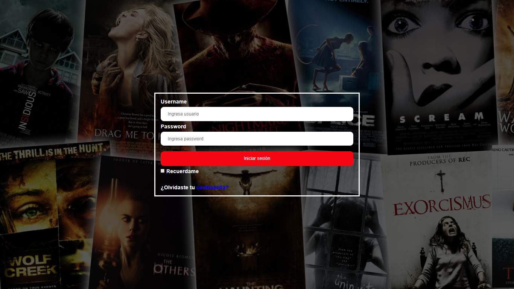

# NetoFlix

Cloon de netflix creado con React.js.  

Para incializar la app tienes que bajar dependecias que se encuentran en el 
package.json y esto lo podemos lograr con el siguientes coomandos.
```sh
$ npm install 
```

una vez ya descargadas las dependencias tenemos que ejecutar en consola el comando de npm 

```sh
$ npm start
```

el resultado sera el login de la app


*  Usuario  - jcbuendia
*  Password - jcbuendia



una vez logeado tendremos el home de la app

## HOME:

 

Para realizar alguna busqueda ediatmos y damos enter y el resultado sera presentado en la parte de abajo 

## BUSQUEDAS:

 
 
