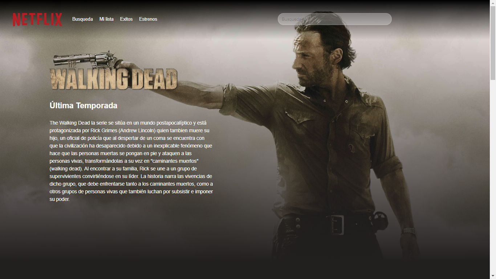
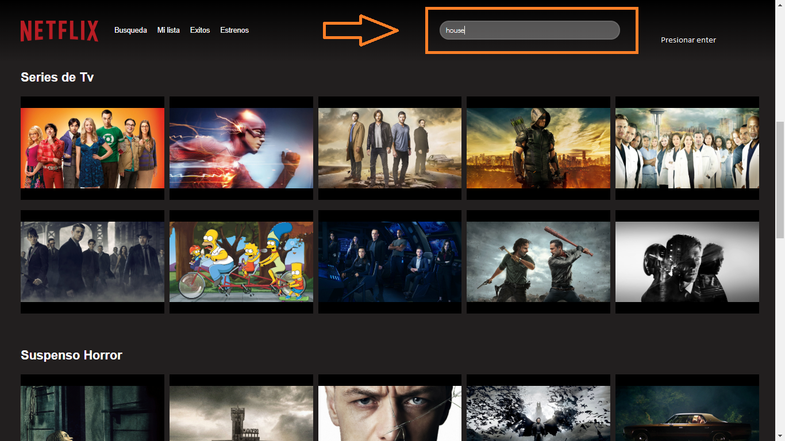
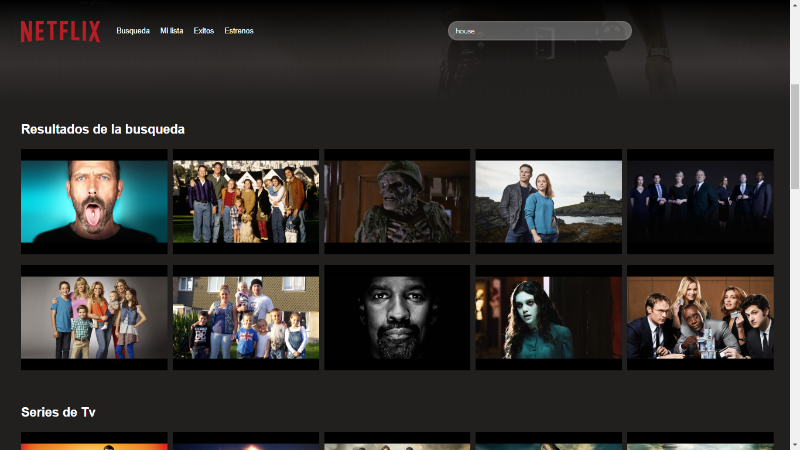

# NetoFlix

Clon de netflix usando React.js.  

Para incializar la app tienes que bajar dependecias que se encuentran en el 
package.json y esto lo podemos lograr con el siguientes comandos.
```sh
$ npm install 
```

una vez ya descargadas las dependencias tenemos que ejecutar en consola el comando de npm 

```sh
$ npm start
```

el resultado sera el login de la app


*  Usuario  - jcbuendia
*  Password - jcbuendia


una vez logeado tendremos el home de la app

## HOME:



Para realizar alguna busqueda editamos y damos enter y el resultado sera presentado en la parte de abajo 

## BUSQUEDAS:






Creado por Juan Carlos Buendia

License
----

MIT


**Free Software, Hell Yeah!**
